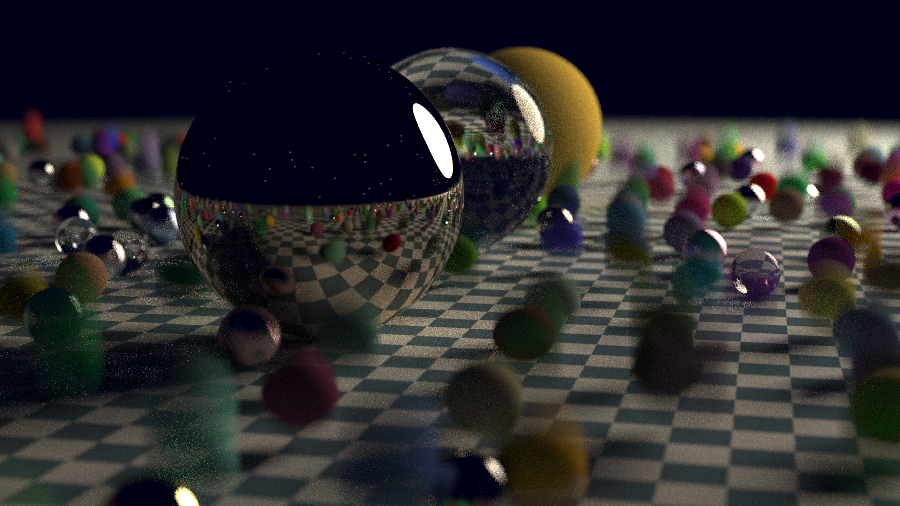

# Ray Tracing Engine — Vulkan (GPU)

A GPU implementation of a physically based path tracer, built on Vulkan compute.

This is the GPU half of a two-part project. The CPU engine is a complete,
importance-sampled path tracer with deterministic output; this repository takes that
renderer onto the GPU, where thousands of pixels are traced concurrently rather than
a handful of tiles across CPU threads.

> **Companion project** — the CPU engine lives at
> [raytracing-engine-cpu](https://github.com/saishmalunde8/raytracing-engine-cpu).
> That repository is canonical for all renderer code; this one carries a snapshot of
> it as a reference implementation.

---

## Current Status

**Vulkan foundation — complete.** Instance creation with portability flags, validation
layers in debug builds, physical device selection and queue family lookup, logical
device with graphics and compute queues, window surface, swapchain with format and
present-mode selection, image views, SPIR-V shader modules, fixed-function pipeline
state, render pass, framebuffers, and a command pool with recorded draw commands.

**Renderer port — not yet started.** The path tracer has not been moved to the GPU.
The CPU implementation under `include/` and `src/` currently runs unchanged, on the CPU.

This ordering is deliberate: the CPU renderer was brought up to date with importance
sampling *before* any GPU sampling code was written, so the port targets the current
algorithm rather than an obsolete one, and has a working reference to be validated
against.

---

## Why Two Backends

The two implementations attack different limits.

Multithreading makes the renderer do the same work faster, and is bounded by core
count — roughly 3× on four cores. Importance sampling makes it do *less* work for the
same image, which on the CPU engine reached equal quality about 39× faster with no
new hardware. A GPU backend attacks the first limit again, far harder: thousands of
concurrent invocations instead of four.

Those gains multiply. The GPU port inherits an algorithm that already needs a fraction
of the samples, so the two improvements compound rather than compete.

---

## CPU Reference Implementation

`include/raytracer/`, `src/main.cpp` and `tools/` hold a snapshot of the CPU engine.
It exists here as a **correctness oracle**: render a scene on both backends and compare.

The exact upstream commit, the sync rules, and detailed notes on which parts of the CPU
code must not be translated literally to GPU are recorded in
[`REFERENCE_VERSION.md`](REFERENCE_VERSION.md).



*Produced by the CPU reference implementation in this repository.*

### What carries over cleanly

The CPU engine was written in a way that happens to suit GPU execution:

- **Coordinate-derived RNG** — `pixel_sample_seed(i, j, sample)` derives randomness
  purely from a pixel's own coordinates, which is exactly what a shader invocation
  requires. A conventional per-thread sequential generator could not be ported at all.
- **Framebuffer-first output** — the renderer writes into a buffer and emits the image
  as a separate pass, matching how a compute shader writes to a storage image.
- **No mutable global state in the render path** — enforced by a build-time guard.
- **Independent, order-independent pixels** — no cross-tile dependencies.

### What has to change

Virtual dispatch, `shared_ptr`, recursion, the BVH's pointer-linked tree, per-bounce
heap allocation, `double` precision, and `std::mt19937` all need GPU-appropriate
replacements. Each is covered in `REFERENCE_VERSION.md`.

---

## Build & Run

### Vulkan backend

Requires the Vulkan SDK (with `VULKAN_SDK` set by its `setup-env.sh`) and GLFW.

```
cmake -B build
cmake --build build
./build/vulkan_backend
```

### CPU reference renderer

Built independently of the Vulkan target, so the two cannot break each other.

```
clang++ -std=c++17 -O2 -Iinclude src/main.cpp -o build/raytracer
./build/raytracer > output.ppm
```

### Sampler validation

Checks the direction samplers and probability densities against analytically known
results — useful for confirming a GPU sampler matches the reference before trusting a
full render.

```
clang++ -std=c++17 -O2 -Iinclude tools/sampling_check.cpp -o build/sampling_check
./build/sampling_check
```

---

## Repository Structure

```
backends/vulkan/ - Vulkan application and GPU backend
shaders/         - GLSL sources and compiled SPIR-V
include/         - CPU reference renderer (snapshot; see REFERENCE_VERSION.md)
src/             - CPU reference entry point and scenes
tools/           - Example scenes and sampler validation
assets/          - Runtime assets (e.g. textures)
docs/            - Documentation and render outputs
external/        - Third-party dependencies (stb_image)
```

---

## Learning Lineage

This project draws from the concepts and techniques presented in Peter Shirley’s
*Ray Tracing in One Weekend* series. The focus of this implementation is on deeply
engaging with the underlying rendering principles and organizing them into a
coherent, extensible system that can serve as a base for further exploration.
